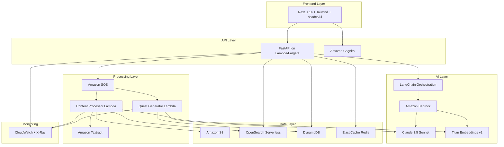
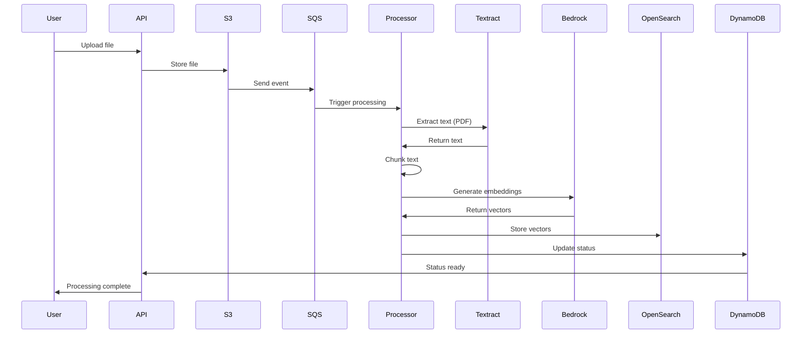
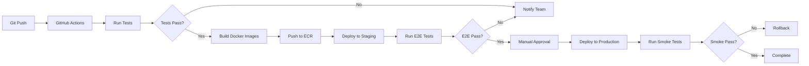

# Design Document: EduQuest Active Learning Engine

## Overview

EduQuest is an AI-native Active Learning OS built on AWS that transforms passive content consumption into active mastery through gamified, contextual learning. The system architecture follows a serverless-first approach leveraging AWS managed services for scalability, reliability, and cost-efficiency.

The platform serves two distinct personas with unified infrastructure:
- **Students**: Learning from academic materials (PDFs, textbooks, EPUB files)
- **Developers**: Onboarding to technical codebases and documentation

The system applies cognitive science principles (retrieval practice, spaced repetition, elaborative interrogation) through an AI-powered challenge generation and tutoring engine grounded in vectorized source material to eliminate hallucinations.

## Architecture

### High-Level Architecture



### Architecture Principles

1. **Serverless-First**: Minimize operational overhead using Lambda, managed databases, and serverless compute
2. **Event-Driven**: Use S3 events and SQS for asynchronous processing pipelines
3. **AI-Grounded**: All AI responses backed by vectorized source material via RAG
4. **Persona-Agnostic Core**: Unified infrastructure with persona-specific challenge generation logic
5. **Real-Time Social**: Redis-backed leaderboards and activity feeds for instant updates
6. **Observable**: Comprehensive logging, tracing, and metrics via CloudWatch and X-Ray

## Components and Interfaces

### 1. Frontend Application

**Technology**: Next.js 14 with App Router, Tailwind CSS, shadcn/ui components

**Deployment**: AWS Amplify with automatic CI/CD from Git repository

**Key Pages**:
- `/dashboard` - Main learning dashboard with active Quests/Sprints
- `/upload` - Content upload interface with drag-and-drop
- `/challenge/:id` - Challenge presentation and submission interface
- `/tutor` - AI tutor chat interface
- `/analytics` - Personal analytics dashboard
- `/squad/:id` - Squad page with leaderboard and activity feed
- `/leaderboard` - Global leaderboard

**State Management**: React Context API for global state, React Query for server state

**API Integration**: REST API client with automatic token refresh via Cognito

### 2. API Gateway and Backend

**Technology**: FastAPI (Python 3.11+) deployed via AWS Lambda with Mangum adapter or AWS Fargate

**API Endpoints**:

```
POST   /api/v1/content/upload          - Initiate content upload
GET    /api/v1/content/:id/status      - Check processing status
POST   /api/v1/quest/generate           - Generate Quest from content
POST   /api/v1/sprint/generate          - Generate Sprint from content
GET    /api/v1/challenge/:id            - Retrieve challenge details
POST   /api/v1/challenge/:id/submit     - Submit challenge answer
POST   /api/v1/tutor/ask                - Ask AI tutor a question
GET    /api/v1/practice/next            - Get next challenge from Practice Engine
POST   /api/v1/squad/create             - Create new Squad
POST   /api/v1/squad/:id/join           - Join Squad with invite code
GET    /api/v1/squad/:id/leaderboard    - Get Squad leaderboard
GET    /api/v1/leaderboard/global       - Get global leaderboard
GET    /api/v1/analytics/dashboard      - Get user analytics
GET    /api/v1/user/profile             - Get user profile
PUT    /api/v1/user/profile             - Update user profile
```

**Authentication**: JWT tokens from Amazon Cognito validated on each request

**Rate Limiting**: Token bucket algorithm (100 requests/minute per user)

**Error Handling**: Standardized error responses with error codes and messages

### 3. Content Processor

**Technology**: AWS Lambda (Python 3.11+) triggered by S3 events and SQS messages

**Processing Pipeline**:



**Chunking Strategy**:
- Semantic chunking with 500-1000 token windows
- 100-token overlap between chunks for context preservation
- Metadata preservation (source file, page number, section heading)

**File Type Handlers**:
- **PDF**: Amazon Textract for text extraction, layout analysis
- **EPUB**: Python `ebooklib` for content extraction
- **GitHub Repos**: `git clone` + tree-sitter for code parsing
- **Markdown/Text**: Direct processing with structure detection

**Vectorization**:
- Model: Amazon Bedrock Titan Embeddings v2 (1024 dimensions)
- Batch size: 25 chunks per API call
- Retry logic: Exponential backoff for rate limits

### 4. Quest Generator

**Technology**: AWS Lambda (Python 3.11+) with LangChain orchestration

**Challenge Generation Flow**:

```python
# Pseudocode for Quest Generation
def generate_quest(content_id: str, persona: str, difficulty: str) -> Quest:
    # 1. Retrieve content chunks from OpenSearch
    chunks = vector_store.similarity_search(
        query="key concepts and important topics",
        k=20,
        filter={"content_id": content_id}
    )
    
    # 2. Analyze content structure
    content_analysis = analyze_content_structure(chunks)
    
    # 3. Determine challenge modalities based on content type
    modalities = select_modalities(content_analysis, persona)
    
    # 4. Generate challenges for each modality
    challenges = []
    for modality in modalities:
        challenge = generate_challenge(
            modality=modality,
            chunks=chunks,
            difficulty=difficulty,
            persona=persona
        )
        challenges.append(challenge)
    
    # 5. Store challenges in DynamoDB
    quest = Quest(
        id=generate_id(),
        content_id=content_id,
        challenges=challenges,
        total_xp=sum(c.xp for c in challenges)
    )
    save_quest(quest)
    
    return quest
```

**Challenge Modalities**:

1. **Fill-in-the-Blank** (Students)
   - Extract key sentences from content
   - Mask important terms/concepts
   - Generate distractors for multiple choice blanks

2. **Multiple Choice Quiz** (Students)
   - Generate questions from factual statements
   - Create 3 plausible distractors + 1 correct answer
   - Include explanations for each option

3. **Visualization Challenges** (Students)
   - Identify diagrams and figures in content
   - Generate questions about relationships and structures
   - Create labeling exercises

4. **Flashcards** (Students)
   - Extract definitions and key concepts
   - Front: term/question, Back: definition/answer
   - Include context from source material

5. **Debugging Challenges** (Developers)
   - Extract code snippets from repository
   - Introduce realistic bugs (off-by-one, null checks, type errors)
   - Provide context about expected behavior

6. **Code Comprehension** (Developers)
   - Generate questions about architecture and design patterns
   - Ask about data flow and control flow
   - Test understanding of API contracts

7. **Refactoring Exercises** (Developers)
   - Identify code smells in snippets
   - Ask for improvements and best practices
   - Compare before/after implementations

**Prompt Engineering**:

```python
# Example prompt template for multiple choice generation
MULTIPLE_CHOICE_PROMPT = """
You are an expert educator creating assessment questions.

Context from source material:
{context}

Generate a multiple choice question that tests understanding of the key concept.

Requirements:
- Question should be clear and unambiguous
- Provide exactly 4 options (A, B, C, D)
- Only one option should be correct
- Distractors should be plausible but clearly wrong
- Include a brief explanation for the correct answer
- Cite the source (page number or section)

Output format (JSON):
{{
  "question": "...",
  "options": {{
    "A": "...",
    "B": "...",
    "C": "...",
    "D": "..."
  }},
  "correct_answer": "A",
  "explanation": "...",
  "source_reference": "Page 42, Section 3.2",
  "difficulty": "intermediate",
  "xp_value": 15
}}
"""
```

### 5. RAG-Powered AI Tutor

**Technology**: LangChain with Amazon Bedrock Claude 3.5 Sonnet

**RAG Pipeline**:

```python
# Pseudocode for RAG Tutor
def answer_question(
    question: str,
    challenge_id: str,
    user_id: str,
    language: str = "en"
) -> TutorResponse:
    # 1. Get challenge context
    challenge = get_challenge(challenge_id)
    content_id = challenge.content_id
    
    # 2. Retrieve relevant chunks
    relevant_chunks = vector_store.similarity_search(
        query=question,
        k=5,
        filter={"content_id": content_id}
    )
    
    # 3. Get user's attempt history for personalization
    user_history = get_user_attempts(user_id, challenge_id)
    
    # 4. Build context for LLM
    context = build_context(
        question=question,
        challenge=challenge,
        chunks=relevant_chunks,
        history=user_history,
        persona=get_user_persona(user_id)
    )
    
    # 5. Generate response with Claude
    response = bedrock_client.invoke_model(
        model="anthropic.claude-3-5-sonnet",
        prompt=build_tutor_prompt(context, language),
        max_tokens=1000,
        temperature=0.7
    )
    
    # 6. Parse and return response
    return TutorResponse(
        answer=response.text,
        sources=extract_sources(relevant_chunks),
        confidence=response.confidence
    )
```

**Persona-Specific Tutoring**:

**Student Mode**:
- Use elaborative interrogation ("Why does this happen?")
- Provide visual analogies and real-world examples
- Break down complex concepts into simpler parts
- Support multiple languages (English, Hindi, Spanish, Mandarin, Arabic)
- Encourage metacognition ("What strategy did you use?")

**Developer Mode**:
- Compare patterns to familiar design patterns (e.g., "This is similar to the Observer pattern")
- Explain code flow with call graphs
- Highlight best practices and anti-patterns
- Reference official documentation and API specs
- Provide debugging strategies and root cause analysis

### 6. Practice Engine

**Technology**: AWS Lambda (Python 3.11+) with DynamoDB for state management

**Spaced Repetition Algorithm**: SM-2 (SuperMemo 2)

```python
# Pseudocode for SM-2 implementation
class SpacedRepetitionScheduler:
    def __init__(self):
        self.min_easiness = 1.3
        
    def calculate_next_review(
        self,
        quality: int,  # 0-5 rating of recall quality
        repetitions: int,
        easiness_factor: float,
        interval: int  # days
    ) -> tuple[int, float, int]:
        """
        Returns: (new_interval, new_easiness_factor, new_repetitions)
        """
        # Update easiness factor
        new_ef = easiness_factor + (0.1 - (5 - quality) * (0.08 + (5 - quality) * 0.02))
        new_ef = max(new_ef, self.min_easiness)
        
        # Update repetitions and interval
        if quality < 3:
            # Incorrect answer - reset
            new_repetitions = 0
            new_interval = 1
        else:
            # Correct answer - increase interval
            new_repetitions = repetitions + 1
            if new_repetitions == 1:
                new_interval = 1
            elif new_repetitions == 2:
                new_interval = 6
            else:
                new_interval = int(interval * new_ef)
        
        return new_interval, new_ef, new_repetitions
```

**Interleaving Strategy**:

```python
# Pseudocode for challenge selection
def select_next_challenge(user_id: str) -> Challenge:
    # 1. Get user's active challenges
    active_challenges = get_active_challenges(user_id)
    
    # 2. Filter challenges due for review
    due_challenges = [
        c for c in active_challenges
        if c.next_review_date <= today()
    ]
    
    # 3. Get recent challenge history (last 3)
    recent_modalities = get_recent_modalities(user_id, limit=3)
    
    # 4. Calculate priority scores
    scored_challenges = []
    for challenge in due_challenges:
        score = calculate_priority_score(
            challenge=challenge,
            recent_modalities=recent_modalities,
            user_performance=get_user_performance(user_id)
        )
        scored_challenges.append((challenge, score))
    
    # 5. Select highest priority challenge
    scored_challenges.sort(key=lambda x: x[1], reverse=True)
    return scored_challenges[0][0] if scored_challenges else None

def calculate_priority_score(
    challenge: Challenge,
    recent_modalities: list[str],
    user_performance: dict
) -> float:
    score = 0.0
    
    # Prioritize overdue challenges
    days_overdue = (today() - challenge.next_review_date).days
    score += days_overdue * 10
    
    # Prioritize low-performance areas
    topic_accuracy = user_performance.get(challenge.topic, 0.5)
    score += (1.0 - topic_accuracy) * 20
    
    # Penalize recently seen modalities (interleaving)
    if challenge.modality in recent_modalities:
        score -= 15
    
    # Prioritize higher difficulty for advanced users
    if user_performance.get("overall_accuracy", 0) > 0.8:
        score += challenge.difficulty_multiplier * 5
    
    return score
```

### 7. Squad System and Leaderboards

**Technology**: DynamoDB for Squad data, ElastiCache Redis for real-time leaderboards

**Data Models**:

```python
# Squad model in DynamoDB
class Squad:
    squad_id: str  # Partition key
    name: str
    invite_code: str  # Unique 8-character code
    owner_user_id: str
    created_at: datetime
    member_count: int
    total_xp: int

# Squad membership model
class SquadMembership:
    squad_id: str  # Partition key
    user_id: str   # Sort key
    joined_at: datetime
    role: str  # "owner" or "member"
    xp_contributed: int
```

**Leaderboard Implementation**:

```python
# Redis sorted sets for leaderboards
# Key: "leaderboard:squad:{squad_id}"
# Score: user XP
# Member: user_id

def update_leaderboard(user_id: str, xp_earned: int):
    # Update global leaderboard
    redis_client.zincrby("leaderboard:global", xp_earned, user_id)
    
    # Update squad leaderboards
    user_squads = get_user_squads(user_id)
    for squad_id in user_squads:
        redis_client.zincrby(
            f"leaderboard:squad:{squad_id}",
            xp_earned,
            user_id
        )

def get_leaderboard(
    scope: str,  # "global" or "squad"
    scope_id: str = None,
    limit: int = 100
) -> list[LeaderboardEntry]:
    key = f"leaderboard:{scope}"
    if scope_id:
        key += f":{scope_id}"
    
    # Get top users with scores
    results = redis_client.zrevrange(key, 0, limit - 1, withscores=True)
    
    # Enrich with user data
    leaderboard = []
    for rank, (user_id, xp) in enumerate(results, start=1):
        user = get_user_profile(user_id)
        leaderboard.append(LeaderboardEntry(
            rank=rank,
            user_id=user_id,
            username=user.username,
            xp=int(xp),
            avatar_url=user.avatar_url
        ))
    
    return leaderboard
```

### 8. Analytics Engine

**Technology**: AWS Lambda with DynamoDB Streams for real-time analytics

**Metrics Tracked**:

```python
class UserAnalytics:
    user_id: str
    date: str  # YYYY-MM-DD
    
    # Activity metrics
    challenges_completed: int
    total_time_minutes: int
    session_count: int
    
    # Performance metrics
    accuracy_rate: float
    average_response_time_seconds: float
    xp_earned: int
    
    # Streak metrics
    current_streak_days: int
    longest_streak_days: int
    
    # Topic-specific metrics
    topic_performance: dict[str, float]  # topic -> accuracy
    
    # Focus score (0-100)
    focus_score: int
```

**Focus Score Calculation**:

```python
def calculate_focus_score(
    session_duration_minutes: int,
    accuracy_rate: float,
    completion_rate: float,
    distraction_events: int
) -> int:
    """
    Focus score combines multiple factors:
    - Session duration (longer sessions = higher focus)
    - Accuracy (higher accuracy = better focus)
    - Completion rate (finishing challenges = commitment)
    - Distraction events (tab switches, long pauses)
    """
    # Normalize session duration (cap at 60 minutes)
    duration_score = min(session_duration_minutes / 60.0, 1.0) * 30
    
    # Accuracy contribution
    accuracy_score = accuracy_rate * 40
    
    # Completion contribution
    completion_score = completion_rate * 20
    
    # Distraction penalty
    distraction_penalty = min(distraction_events * 5, 20)
    
    focus_score = duration_score + accuracy_score + completion_score - distraction_penalty
    return int(max(0, min(100, focus_score)))
```

**Time-to-Competency Tracking**:

```python
def calculate_time_to_competency(
    user_id: str,
    content_id: str,
    competency_threshold: float = 0.8
) -> Optional[timedelta]:
    """
    Measures time from first challenge to achieving competency threshold
    """
    attempts = get_user_attempts(user_id, content_id)
    if not attempts:
        return None
    
    # Calculate rolling accuracy over last 10 attempts
    for i in range(9, len(attempts)):
        window = attempts[i-9:i+1]
        accuracy = sum(1 for a in window if a.correct) / 10.0
        
        if accuracy >= competency_threshold:
            first_attempt_time = attempts[0].timestamp
            competency_time = attempts[i].timestamp
            return competency_time - first_attempt_time
    
    return None  # Not yet competent
```

## Data Models

### DynamoDB Tables

**Table: Users**
```
Partition Key: user_id (string)
Attributes:
  - email: string
  - username: string
  - persona: string ("student" | "developer")
  - language_preference: string
  - daily_goal_xp: number
  - total_xp: number
  - current_streak: number
  - longest_streak: number
  - created_at: string (ISO 8601)
  - last_active_at: string (ISO 8601)
```

**Table: Content**
```
Partition Key: content_id (string)
Attributes:
  - user_id: string
  - file_name: string
  - file_type: string ("pdf" | "epub" | "github")
  - s3_key: string
  - status: string ("processing" | "ready" | "failed")
  - chunk_count: number
  - created_at: string (ISO 8601)
  - metadata: map (title, author, page_count, etc.)
```

**Table: Challenges**
```
Partition Key: challenge_id (string)
Sort Key: content_id (string)
Attributes:
  - quest_id: string
  - modality: string
  - difficulty: string ("beginner" | "intermediate" | "advanced")
  - question: string
  - options: map (for multiple choice)
  - correct_answer: string
  - explanation: string
  - source_reference: string
  - xp_value: number
  - tags: list[string]
```

**Table: UserChallenges**
```
Partition Key: user_id (string)
Sort Key: challenge_id (string)
Attributes:
  - repetitions: number
  - easiness_factor: number
  - interval_days: number
  - next_review_date: string (ISO 8601)
  - last_reviewed_at: string (ISO 8601)
  - total_attempts: number
  - correct_attempts: number
  - accuracy_rate: number
```

**Table: Attempts**
```
Partition Key: user_id (string)
Sort Key: attempt_id (string)
Attributes:
  - challenge_id: string
  - content_id: string
  - submitted_answer: string
  - is_correct: boolean
  - time_taken_seconds: number
  - xp_earned: number
  - timestamp: string (ISO 8601)
```

**Table: Squads**
```
Partition Key: squad_id (string)
Attributes:
  - name: string
  - invite_code: string
  - owner_user_id: string
  - member_count: number
  - total_xp: number
  - created_at: string (ISO 8601)
```

**Table: SquadMemberships**
```
Partition Key: squad_id (string)
Sort Key: user_id (string)
Attributes:
  - role: string ("owner" | "member")
  - joined_at: string (ISO 8601)
  - xp_contributed: number
GSI: user_id (partition key) for reverse lookup
```

### OpenSearch Index Schema

**Index: content_chunks**
```json
{
  "mappings": {
    "properties": {
      "chunk_id": {"type": "keyword"},
      "content_id": {"type": "keyword"},
      "text": {"type": "text"},
      "embedding": {
        "type": "knn_vector",
        "dimension": 1024,
        "method": {
          "name": "hnsw",
          "space_type": "cosinesimil",
          "engine": "nmslib"
        }
      },
      "metadata": {
        "properties": {
          "source_file": {"type": "keyword"},
          "page_number": {"type": "integer"},
          "section": {"type": "text"},
          "chunk_index": {"type": "integer"}
        }
      },
      "created_at": {"type": "date"}
    }
  }
}
```


## Correctness Properties

*A property is a characteristic or behavior that should hold true across all valid executions of a system—essentially, a formal statement about what the system should do. Properties serve as the bridge between human-readable specifications and machine-verifiable correctness guarantees.*

### Content Processing Properties

**Property 1: File Upload Storage Consistency**
*For any* uploaded file, the file should be stored in Amazon S3 and a corresponding record should exist in DynamoDB with matching content_id and s3_key.
**Validates: Requirements 1.5**

**Property 2: Chunk Size Bounds**
*For any* extracted content that is chunked, all chunks should have token counts between 500 and 1000 tokens (inclusive).
**Validates: Requirements 2.1**

**Property 3: Embedding Dimension Consistency**
*For any* generated embedding vector, the dimension should be exactly 1024 (Titan Embeddings v2 output size).
**Validates: Requirements 2.2**

**Property 4: Vectorization Completion State Transition**
*For any* content that completes vectorization successfully, the content status in DynamoDB should transition from "processing" to "ready".
**Validates: Requirements 2.4**

**Property 5: Vector Search Confidence Threshold**
*For any* similarity search query, all returned chunks should have confidence scores >= 0.7.
**Validates: Requirements 2.6**

**Property 6: Async Processing Threshold**
*For any* uploaded file with size > 10MB, the processing should be queued to Amazon SQS rather than processed synchronously.
**Validates: Requirements 1.4**

**Property 7: Error Handling Completeness**
*For any* content extraction that fails, the system should return an error response AND log the error to CloudWatch.
**Validates: Requirements 1.7**

### Challenge Generation Properties

**Property 8: Multiple Choice Structure**
*For any* generated multiple-choice challenge, it should have exactly 4 options (A, B, C, D), exactly one correct answer, and a non-empty explanation.
**Validates: Requirements 3.4**

**Property 9: Source Reference Inclusion**
*For any* generated challenge, it should include a source_reference field that is non-empty and references the original content (page number, section, or file path).
**Validates: Requirements 3.7, 4.7**

**Property 10: Difficulty Rating Assignment**
*For any* generated challenge, it should have a difficulty rating that is one of: "beginner", "intermediate", or "advanced".
**Validates: Requirements 3.8**

**Property 11: XP Value Bounds**
*For any* generated challenge, the xp_value should be between 10 and 100 (inclusive).
**Validates: Requirements 4.8**

**Property 12: Challenge Storage Consistency**
*For any* generated challenge, it should be stored in DynamoDB with a valid content_id association that references an existing content record.
**Validates: Requirements 3.9**

**Property 13: Flashcard Structure**
*For any* generated flashcard challenge, it should have both a non-empty question (front) and a non-empty answer (back) derived from key concepts.
**Validates: Requirements 3.6**

**Property 14: Debugging Challenge Bug Presence**
*For any* generated debugging challenge, the code snippet should contain at least one introduced bug that differs from the original source code.
**Validates: Requirements 4.2**

**Property 15: Refactoring Exercise Completeness**
*For any* generated refactoring exercise, it should include both a "before" code snippet and an "after" code snippet that are different.
**Validates: Requirements 4.4**

### RAG Tutor Properties

**Property 16: Context Retrieval for Tutor Requests**
*For any* tutor help request, the RAG_Tutor should retrieve at least one relevant chunk from the Vector_Store before generating a response.
**Validates: Requirements 5.1, 6.1**

**Property 17: Source Citation in Tutor Responses**
*For any* tutor response, it should include at least one citation to source material (page number, section, or file reference).
**Validates: Requirements 5.7, 6.7**

**Property 18: Low Confidence Clarification**
*For any* tutor request where the maximum confidence score of retrieved chunks is below 0.5, the response should request clarification rather than provide a definitive answer.
**Validates: Requirements 5.8**

**Property 19: Step-by-Step Breakdown for Complex Problems**
*For any* tutor response to a challenge marked as "advanced" difficulty, the explanation should contain multiple distinct steps (at least 2).
**Validates: Requirements 5.5**

**Property 20: Bug Explanation Completeness**
*For any* tutor response explaining a debugging challenge, it should include both a root cause description and at least one prevention strategy.
**Validates: Requirements 6.6**

### Practice Engine Properties

**Property 21: SM-2 Interval Increase on Correct Answer**
*For any* challenge completion with a correct answer (quality >= 3), the next review interval should be greater than or equal to the previous interval.
**Validates: Requirements 7.5**

**Property 22: SM-2 Interval Reset on Incorrect Answer**
*For any* challenge completion with an incorrect answer (quality < 3), the next review interval should be reset to 1 day.
**Validates: Requirements 7.6**

**Property 23: Repetition Interval Update**
*For any* completed challenge, the UserChallenges record should have its interval_days and next_review_date fields updated.
**Validates: Requirements 7.2**

**Property 24: Modality Interleaving Constraint**
*For any* sequence of 4 consecutive challenges delivered to a user, no more than 3 should have the same modality.
**Validates: Requirements 7.7**

**Property 25: Low Performance Prioritization**
*For any* user with topic-specific accuracy data, when selecting the next challenge, topics with accuracy < 0.6 should be prioritized over topics with accuracy >= 0.8.
**Validates: Requirements 7.4**

**Property 26: Difficulty Adaptation**
*For any* user with a rolling 10-challenge accuracy rate > 0.8, the next selected challenge should have difficulty >= "intermediate".
**Validates: Requirements 7.8**

### User Management Properties

**Property 27: Profile Creation on Registration**
*For any* new user registration, a user profile should be created in DynamoDB with all required fields: user_id, email, username, persona, total_xp (initialized to 0), current_streak (initialized to 0).
**Validates: Requirements 8.3**

**Property 28: User Preferences Persistence**
*For any* user profile, it should maintain fields for language_preference, daily_goal_xp, and persona.
**Validates: Requirements 8.4**

**Property 29: Challenge History Storage**
*For any* challenge submission, an Attempts record should be created with timestamp, is_correct, time_taken_seconds, and xp_earned fields.
**Validates: Requirements 8.6**

**Property 30: Active State Loading on Login**
*For any* user login, the response should include the user's active Quests/Sprints (those with status != "completed").
**Validates: Requirements 8.7**

### Squad System Properties

**Property 31: Unique Invite Code Generation**
*For any* two distinct Squads, their invite_codes should be different.
**Validates: Requirements 9.1**

**Property 32: Squad Membership Storage**
*For any* user who joins a Squad, a SquadMembership record should exist with the squad_id, user_id, and role fields.
**Validates: Requirements 9.3**

**Property 33: Leaderboard Update Timeliness**
*For any* challenge completion that awards XP, the Squad and global leaderboards should reflect the updated XP within 1 second.
**Validates: Requirements 9.4, 9.5, 13.3**

**Property 34: Squad Activity Feed Updates**
*For any* challenge completion by a Squad member, the Squad activity feed should include an entry for that completion.
**Validates: Requirements 9.6**

**Property 35: Squad Notification on Completion**
*For any* challenge completion by a Squad member, all other members of that Squad should receive a notification.
**Validates: Requirements 9.7**

### Analytics Properties

**Property 36: Focus Score Bounds**
*For any* calculated focus score, the value should be between 0 and 100 (inclusive).
**Validates: Requirements 10.1**

**Property 37: Streak Increment on Daily Activity**
*For any* user who completes at least one challenge on consecutive days, their current_streak should increment by 1.
**Validates: Requirements 10.2**

**Property 38: Knowledge Gap Identification**
*For any* user who answers the same challenge incorrectly 3 or more times, that challenge's topic should be flagged as a knowledge gap.
**Validates: Requirements 10.4**

**Property 39: Squad Performance Comparison**
*For any* user who is a member of at least one Squad, their analytics should include a comparison metric showing their performance relative to the Squad average.
**Validates: Requirements 10.7**

**Property 40: Analytics Event Logging**
*For any* analytics event (challenge completion, streak update, focus score calculation), a corresponding log entry should appear in CloudWatch.
**Validates: Requirements 10.8**

### API and System Properties

**Property 41: Real-Time Upload Status**
*For any* content upload in progress, querying the status endpoint should return the current processing stage ("extracting", "chunking", "vectorizing", or "ready").
**Validates: Requirements 11.3**

**Property 42: Syntax Highlighting for Code**
*For any* challenge that includes a code snippet, the rendered HTML should include syntax highlighting markup (CSS classes or inline styles).
**Validates: Requirements 11.4**

**Property 43: Immediate Submission Feedback**
*For any* challenge submission, the response should include immediate feedback (correct/incorrect, xp_earned, explanation) within the same HTTP response.
**Validates: Requirements 11.5**

**Property 44: Page Load Performance**
*For any* page request, the time-to-first-byte should be less than 2 seconds under normal load conditions.
**Validates: Requirements 11.8**

**Property 45: Rate Limiting Enforcement**
*For any* user making more than 100 API requests within a 60-second window, subsequent requests should receive a 429 (Too Many Requests) response.
**Validates: Requirements 12.5**

**Property 46: Input Validation**
*For any* API request with invalid input (missing required fields, wrong types, out-of-range values), the response should be a 400 (Bad Request) with a descriptive validation error.
**Validates: Requirements 12.6**

**Property 47: Standardized Error Format**
*For any* API error response, it should include a JSON body with fields: error_code, message, and request_id.
**Validates: Requirements 12.7**

**Property 48: Request Logging**
*For any* API request, a log entry should appear in CloudWatch containing the request_id, endpoint, method, user_id, and timestamp.
**Validates: Requirements 12.8**

### Security Properties

**Property 49: Input Sanitization**
*For any* user input containing SQL injection patterns (e.g., "'; DROP TABLE"), the input should be sanitized or rejected before database operations.
**Validates: Requirements 14.4**

**Property 50: Private File Access**
*For any* user file stored in S3, attempting to access the file without proper authentication should result in an access denied error.
**Validates: Requirements 14.5**

**Property 51: Sensitive Data Audit Logging**
*For any* access to user personal data (email, profile, challenge history), an audit log entry should be created in CloudWatch with the accessor's identity and timestamp.
**Validates: Requirements 14.8**

### Monitoring Properties

**Property 52: Error Logging**
*For any* exception or error that occurs in the system, a log entry should appear in CloudWatch with the error message, stack trace, and context.
**Validates: Requirements 15.1**

**Property 53: AI Token Usage Tracking**
*For any* invocation of Amazon Bedrock models (Claude or Titan), the token count and estimated cost should be logged to CloudWatch.
**Validates: Requirements 15.6**

## Error Handling

### Error Categories

1. **User Input Errors** (4xx responses)
   - Invalid file formats
   - Missing required fields
   - Out-of-range values
   - Authentication failures

2. **System Errors** (5xx responses)
   - AWS service failures (Bedrock, Textract, OpenSearch)
   - Database connection errors
   - Timeout errors
   - Out of memory errors

3. **Business Logic Errors**
   - Insufficient content for challenge generation
   - No challenges available for practice
   - Squad invite code not found

### Error Response Format

```json
{
  "error_code": "CONTENT_PROCESSING_FAILED",
  "message": "Failed to extract text from PDF: file appears to be corrupted",
  "request_id": "req_abc123xyz",
  "timestamp": "2024-01-15T10:30:00Z",
  "details": {
    "file_name": "textbook.pdf",
    "file_size_mb": 15.2,
    "error_stage": "textract_extraction"
  }
}
```

### Retry Strategies

**Exponential Backoff for AWS Services**:
```python
def retry_with_backoff(func, max_retries=3):
    for attempt in range(max_retries):
        try:
            return func()
        except (ThrottlingException, ServiceUnavailableException) as e:
            if attempt == max_retries - 1:
                raise
            wait_time = (2 ** attempt) + random.uniform(0, 1)
            time.sleep(wait_time)
```

**Circuit Breaker for External Services**:
- Open circuit after 5 consecutive failures
- Half-open state after 30 seconds
- Close circuit after 2 successful requests

### Graceful Degradation

1. **AI Service Unavailable**: Fall back to cached challenge templates
2. **Vector Search Unavailable**: Use keyword-based search on DynamoDB
3. **Redis Unavailable**: Compute leaderboards on-demand from DynamoDB
4. **Textract Unavailable**: Use fallback OCR library (Tesseract)

## Testing Strategy

### Dual Testing Approach

The EduQuest system requires both unit testing and property-based testing for comprehensive coverage:

**Unit Tests**: Verify specific examples, edge cases, and error conditions
- Specific file format handling (corrupted PDFs, malformed EPUB)
- Authentication flows (login, registration, token refresh)
- Integration points between AWS services
- Edge cases (empty content, single-word documents, maximum file sizes)
- Error conditions (network failures, service timeouts)

**Property Tests**: Verify universal properties across all inputs
- Challenge generation correctness across random content
- SM-2 algorithm implementation across random user histories
- Leaderboard consistency across random XP updates
- Input validation across random malformed inputs
- Data consistency across random operation sequences

### Property-Based Testing Configuration

**Framework**: Hypothesis (Python) for backend, fast-check (TypeScript) for frontend

**Configuration**:
- Minimum 100 iterations per property test (due to randomization)
- Seed-based reproducibility for failed tests
- Shrinking enabled to find minimal failing examples
- Timeout: 60 seconds per property test

**Test Tagging**:
Each property test must reference its design document property:
```python
@given(content=st.text(min_size=100), difficulty=st.sampled_from(["beginner", "intermediate", "advanced"]))
@settings(max_examples=100)
def test_challenge_xp_bounds(content, difficulty):
    """
    Feature: eduquest-active-learning-engine, Property 11: XP Value Bounds
    For any generated challenge, the xp_value should be between 10 and 100 (inclusive).
    """
    challenge = generate_challenge(content, difficulty)
    assert 10 <= challenge.xp_value <= 100
```

### Test Coverage Goals

- **Unit Test Coverage**: 80% line coverage minimum
- **Property Test Coverage**: All 53 correctness properties implemented
- **Integration Test Coverage**: All API endpoints with happy path and error cases
- **E2E Test Coverage**: Critical user flows (upload → generate → practice → complete)

### Testing Environments

1. **Local Development**: LocalStack for AWS services, in-memory databases
2. **CI/CD Pipeline**: GitHub Actions with AWS service mocks
3. **Staging**: Full AWS environment with test data
4. **Production**: Synthetic monitoring with canary tests

### Performance Testing

- **Load Testing**: Locust or k6 for API endpoint load testing
- **Stress Testing**: Gradually increase load to find breaking points
- **Soak Testing**: Sustained load over 24 hours to detect memory leaks
- **Spike Testing**: Sudden traffic spikes to test auto-scaling

### Security Testing

- **OWASP Top 10**: Automated scanning with OWASP ZAP
- **Dependency Scanning**: Snyk or Dependabot for vulnerability detection
- **Penetration Testing**: Manual testing by security team before launch
- **Compliance Auditing**: GDPR compliance verification

## Deployment Strategy

### Infrastructure as Code

**AWS CDK** (TypeScript) for infrastructure definition:
- VPC and networking configuration
- Lambda functions with appropriate IAM roles
- DynamoDB tables with GSIs
- OpenSearch Serverless collections
- ElastiCache Redis clusters
- S3 buckets with lifecycle policies
- CloudWatch dashboards and alarms

### CI/CD Pipeline



### Deployment Stages

1. **Development**: Automatic deployment on every commit to `develop` branch
2. **Staging**: Automatic deployment on every commit to `main` branch
3. **Production**: Manual approval required after staging validation

### Rollback Strategy

- **Lambda**: Maintain previous 3 versions, instant rollback via alias update
- **Database**: Schema migrations with rollback scripts
- **Frontend**: CloudFront cache invalidation + S3 version rollback
- **Feature Flags**: LaunchDarkly for gradual rollout and instant disable

### Monitoring and Alerting

**CloudWatch Alarms**:
- API error rate > 5%
- API latency p99 > 2 seconds
- Lambda cold start rate > 20%
- DynamoDB throttled requests > 10/minute
- OpenSearch cluster health != green

**On-Call Rotation**:
- PagerDuty integration for critical alarms
- Escalation policy: 5 minutes → team lead → engineering manager
- Runbooks for common incidents in Confluence

## Success Metrics

### User Engagement Metrics

- **Daily Active Users (DAU)**: Target 1,000+ within 3 months
- **Session Duration**: Average 20+ minutes per session
- **Completion Rate**: 70%+ of started challenges completed
- **Retention**: 40%+ weekly retention rate

### Learning Effectiveness Metrics

- **Knowledge Retention**: 90%+ accuracy on challenges reviewed after 30 days
- **Time-to-Competency**: 50% reduction vs. traditional learning methods
- **Focus Score**: Average 75+ across all users
- **Streak Maintenance**: 30%+ of users maintain 7+ day streaks

### Technical Performance Metrics

- **API Latency**: p95 < 500ms, p99 < 2s
- **Uptime**: 99.9% availability
- **Error Rate**: < 1% of all requests
- **Cold Start Rate**: < 10% of Lambda invocations

### Business Metrics

- **User Acquisition Cost**: < $10 per user
- **Monthly Active Users (MAU)**: 5,000+ within 6 months
- **Squad Formation Rate**: 40%+ of users join or create a Squad
- **Content Upload Rate**: Average 2+ uploads per active user per month

### AWS Cost Optimization

- **Bedrock Costs**: < $0.10 per user per month
- **OpenSearch Costs**: < $200/month for 10,000 users
- **Lambda Costs**: < $100/month with proper optimization
- **Total Infrastructure**: < $500/month for 10,000 users

## Future Enhancements

### Phase 2 Features

1. **Voice-Based Learning**: Integration with Amazon Polly for audio challenges
2. **Collaborative Challenges**: Real-time multiplayer quiz battles
3. **Adaptive Learning Paths**: ML-powered curriculum generation
4. **Mobile Apps**: Native iOS and Android applications
5. **Offline Mode**: Progressive Web App with offline challenge access

### Phase 3 Features

1. **Enterprise Features**: SSO, team analytics, custom branding
2. **Marketplace**: User-generated challenge packs
3. **Certification Programs**: Verified skill assessments
4. **Integration APIs**: LMS integration (Canvas, Moodle, Blackboard)
5. **Advanced Analytics**: Predictive modeling for learning outcomes

### Research Opportunities

1. **Optimal Spaced Repetition**: A/B testing different algorithms (SM-2 vs. SM-17 vs. FSRS)
2. **Challenge Difficulty Calibration**: ML models for automatic difficulty rating
3. **Personalized Explanations**: Fine-tuned LLMs for individual learning styles
4. **Cognitive Load Optimization**: Adaptive challenge pacing based on cognitive load theory
